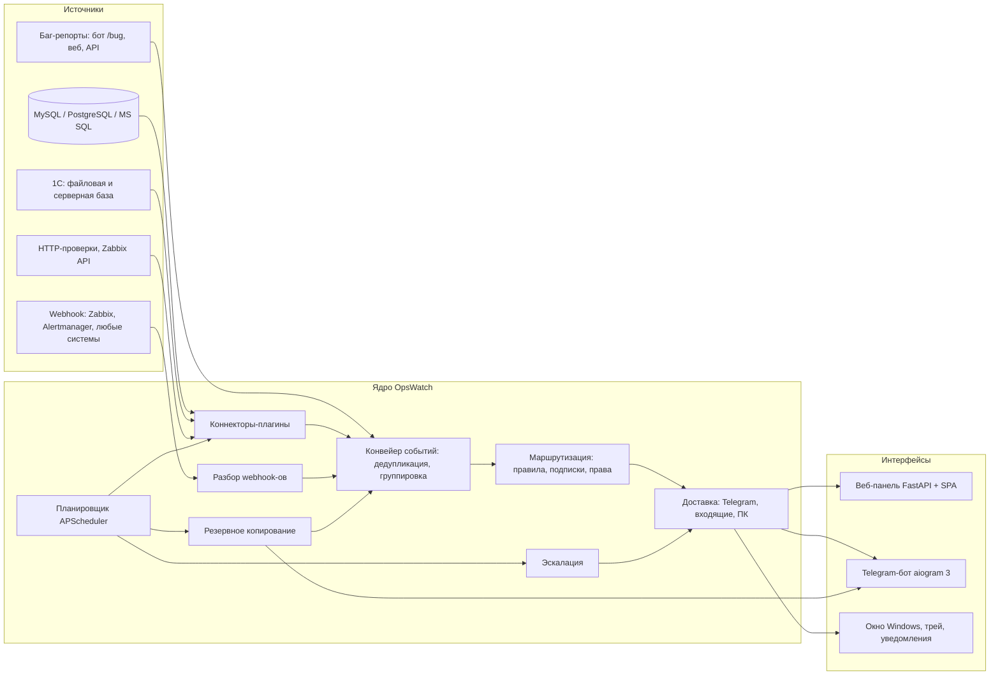
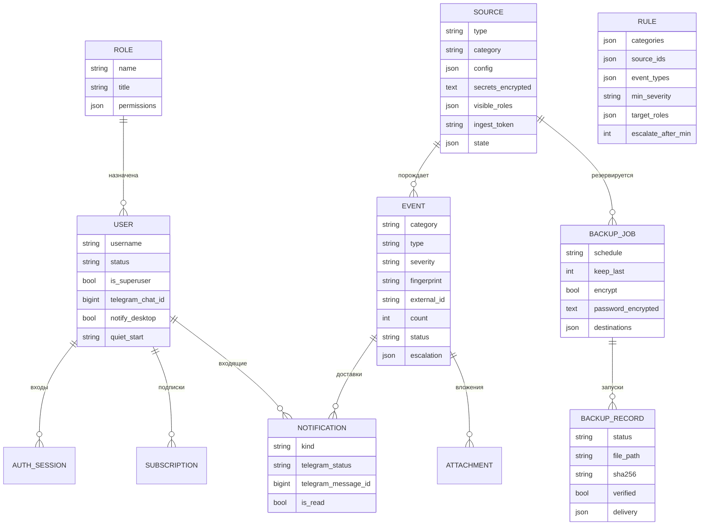
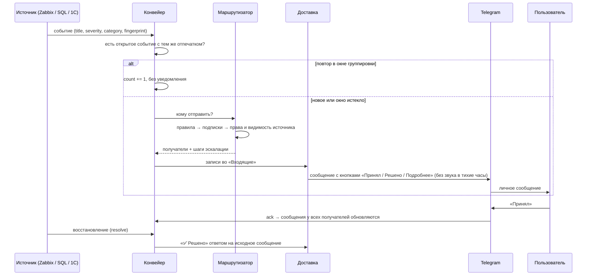

# Архитектура OpsWatch

OpsWatch — один асинхронный процесс на Python 3.11+, внутри которого работают веб-панель (FastAPI), Telegram-бот (aiogram 3), планировщик (APScheduler) и конвейер событий. Настольное приложение для Windows — это тот же сервер плюс окно (pywebview), значок в трее и всплывающие уведомления.

## Схема модулей



## Структура репозитория

```
opswatch/
  config.py            настройки из .env и переменных окружения
  db.py, models.py     SQLAlchemy 2 (async), SQLite по умолчанию, PostgreSQL опционально
  security.py          scrypt-хэши паролей, Fernet-шифрование секретов, токены сессий
  permissions.py       права, видимость категорий и источников
  runtime.py           сборка всех компонентов в один объект
  core/
    events.py          модель входящего события EventIn, нормализация важности
    pipeline.py        приём, группировка, авто-закрытие, подтверждение, эскалация
    router.py          правила маршрутизации, подписки, тихие часы
    notifier.py        очередь доставки в Telegram, обновление сообщений
    render.py          оформление сообщений и кнопок
    ingest.py          разбор Zabbix / Alertmanager / универсального JSON
    sources.py         опрос коннекторов, статус «недоступен/доступен»
    scheduler.py       задания опроса, бэкапов, обслуживания и очистки
  connectors/          коннекторы: sql, onec, onec_log, monitoring, checks
  backup/              движки дампов, архивирование AES-256, доставка, ротация
  bot/                 менеджер бота и обработчики команд
  web/                 FastAPI, маршруты API, статический фронтенд
  desktop/             окно, трей, агент уведомлений, служба Windows, иконка
packaging/             спецификация PyInstaller и файлы для zip-архива
examples/              скрипт Zabbix, конфиг Alertmanager, пример плагина
tests/                 pytest
```

## Модель данных



* **Категории событий**: `monitoring`, `database`, `onec`, `backup`, `bug`, `system`.
* **Важность**: `info`, `warning`, `critical`.
* **Статусы**: `new` → `acked` (принято) → `resolved` (решено).
* Пароли баз данных, токены ботов и пароли архивов хранятся только в зашифрованном виде (`Fernet`, ключ — `data/secret.key` или `OPSWATCH_SECRET_KEY`).

## Путь события от источника до Telegram



### Защита от спама

* **Группировка** — одинаковые события (по отпечатку) не рассылаются повторно чаще, чем раз в `group_window_min` минут; счётчик повторов растёт.
* **Тихие часы** — у каждого пользователя свои; некритичные уведомления приходят без звука.
* **Эскалация** — правило может указать «если критичное событие не подтверждено за N минут — отправить ролям/пользователям X».
* **Подписки** — пользователь может подписаться на категорию целиком или заглушить её (кроме критичных по правилам).

## Режимы запуска

| Режим | Команда | Для чего |
| --- | --- | --- |
| Настольное приложение | `OpsWatch.exe` | окно, трей, уведомления Windows; выбор «сервер» или «подключиться к серверу» |
| Служба Windows | `OpsWatchServer.exe install` / `start` | круглосуточная работа без входа пользователя |
| Консоль | `OpsWatchServer.exe run`, `opswatch run` | сервер без окна |
| Docker | `docker compose up -d` | Linux-серверы |

## План развития по этапам

1. **MVP (готово)**: ядро событий, Telegram-бот, коннекторы MySQL/PostgreSQL/MS SQL, бэкапы, маршрутизация, веб-панель, роли.
2. **1С (готово базово)**: файловые и серверные базы, журнал регистрации (`.lgd` и `.lgp`), проверка целостности, HTTP/OData.
3. **Мониторинг (готово базово)**: Zabbix webhook и API, Alertmanager, универсальный webhook, HTTP-проверки.
4. **Дальше**: миграции схемы (Alembic), RAS/RAC-мониторинг кластера 1С, графики метрик, шаблоны сообщений, двухфакторный вход, i18n.
